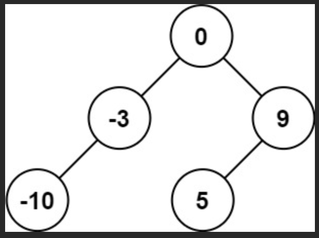
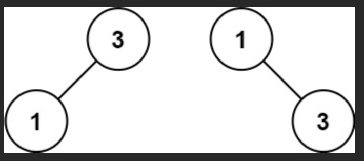

## Description

Given an integer array nums where the elements are sorted in ascending order, convert it to a
height-balanced
binary search tree.

## Examples

```JS


Input: nums = [-10,-3,0,5,9]
Output: [0,-3,9,-10,null,5]



Input: nums = [1,3]
Output: [3,1]
Explanation: [1,null,3] and [3,1] are both height-balanced BSTs.
```
